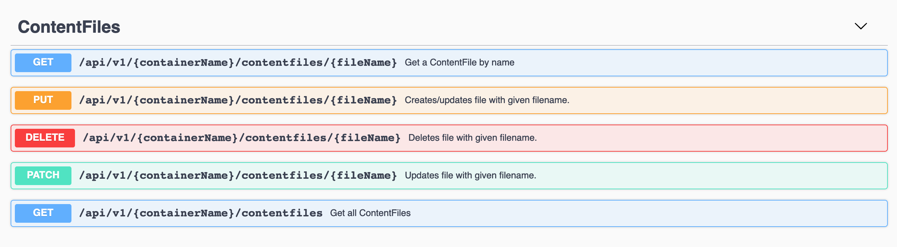
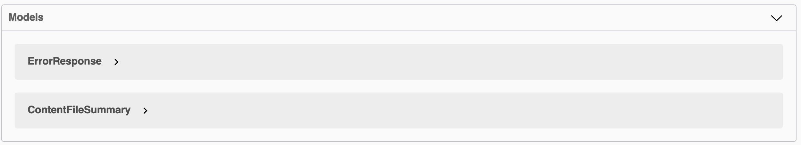

# azure-content-files-api
ASP.NET (C#) MVC web service to provide a simple REST resource interface for Azure Cloud Blobs. It allows uploading, downloading, overwriting, and listing files in Azure containers based on names assigned by the user.

Interesting fact: containers are private by default, but are made publicly available behind-the-scenes if they contain the word 'public'.

Completed as part of CSCI-E94 at Harvard University. (Assignment 3)

## Configuration

To run this API, you would have to set up a real Azure storage connection string in your appsettings.Production.json. No other configuration is required; the service will create containers as needed.

## Usage

If you run this yourself, a URL path like this will open the Swagger UI: https://{base_url}/swagger/index.html (currently configured to open automatically if running locally)

It should look something like this:

